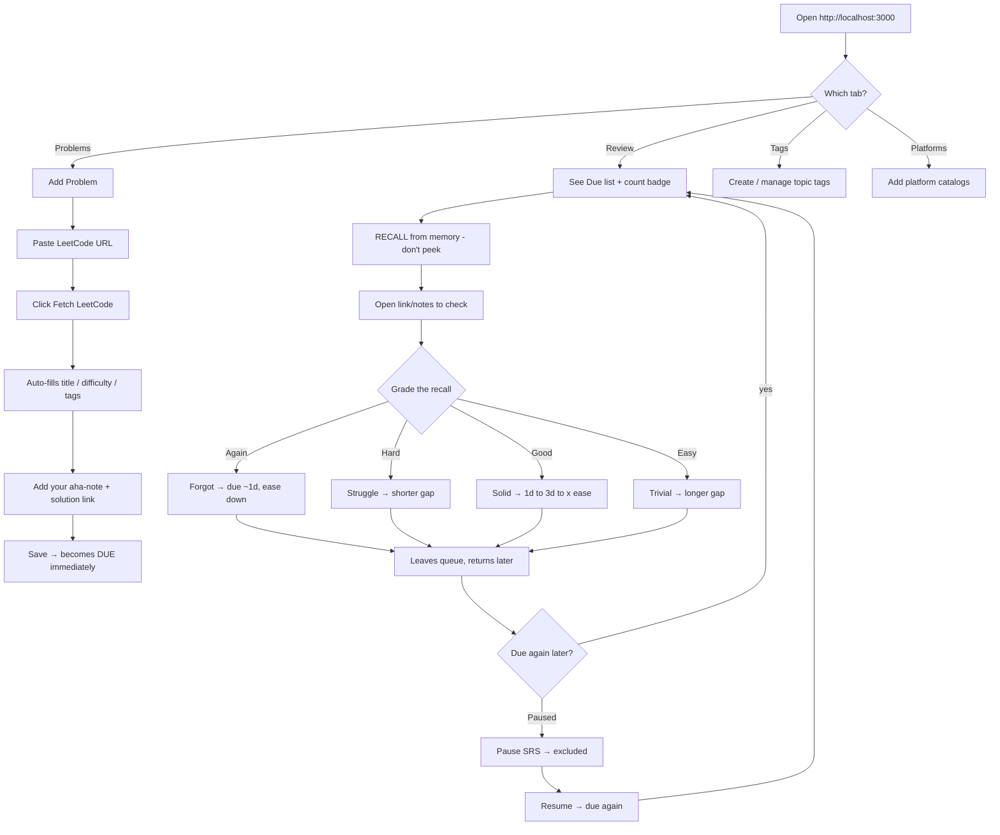

# 🐐 GoatCode

**GoatCode** is a local-first, single-user training vault for competitive programming and interview prep. Track problems, capture aha moments, and re-practice with built-in spaced repetition.

## Features

- **Problem vault** — platforms, tags, notes, solution links (GitHub / local files)
- **Spaced repetition** — Again / Hard / Good / Easy scheduling (SM-2 style, no Anki)
- **Platform pull-in** — paste a LeetCode / Codeforces / AtCoder URL → auto-fetch title, difficulty, and tags
- **Local SQLite** — your data stays on disk; automatic backups on writes

## What “due” means

**Due does not mean** “problems you solved after some date.”

**Due means** this problem is **scheduled for re-practice right now**:

1. You solve a problem (on LeetCode, etc.).
2. You save it in GoatCode (with notes/tags).
3. It becomes **due** so you can review/schedule it.
4. You grade Again / Hard / Good / Easy.
5. GoatCode sets the next review date (e.g. +1 day, +3 days, +weeks).
6. When that date arrives, it becomes **due** again.

The Review tab is your daily “what should I drill?” queue.

## Run

```bash
npm install
npx prisma db push
npm run prisma:seed
npm run dev
```

Open **http://localhost:3000** (personal workspace — Review, Problems, Tags, Platforms).

Legacy `/admin` redirects to `/`. For full setup, daily usage, the recall method, backups, and a
scripts reference, see [run.md](./run.md).

## Typical workflow

1. Solve a problem on LeetCode / Codeforces / AtCoder.
2. **Add Problem** → paste the problem URL → **Fetch Problem** (autofills title, difficulty, tags).
3. Write your aha note → save.
4. Open **Review** → re-solve from notes → grade yourself.
5. Come back later when items mature back into the due list.

### How to use the app



**Tab / action map**

| Tab        | What you do                                                                 |
|------------|-----------------------------------------------------------------------------|
| Review     | Daily queue. Recall → grade Again/Hard/Good/Easy. Pause/Resume, Upcoming (7d), due badge. |
| Problems   | Add (LeetCode pull-in), browse, grade, Reset SRS, Delete. Shows "Due" / "in 5d" / "Paused". |
| Tags       | Topics used to organize problems (auto-created from LeetCode on fetch).     |
| Platforms  | LeetCode, Codeforces, CSES, AtCoder, …                                      |

**The core loop:** Solve → Save (Fetch) → it's Due → Recall → Grade → wait → Due again

### Grade buttons

| Grade | Meaning | Scheduling (simplified) |
|--------|---------|-------------------------|
| Again | Forgot | Reset streak; due in ~1 day |
| Hard | Struggle | Shorter growth |
| Good | Solid | Normal SM-2 interval growth |
| Easy | Trivial | Longer interval |

## Database backups

Automatic backups to `backups/sqlite/` on create/update/delete/review.

```bash
npm run db:backup
npm run db:backups:list
npm run db:restore
```

## Tests

The SM-2 scheduler has dependency-free unit tests (no extra deps — runs via `tsx`):

```bash
npx tsx scripts/test-srs.ts
```

## Tech stack

Next.js 16 · Prisma · SQLite · tRPC · TanStack Query · TypeScript

## License

MIT
